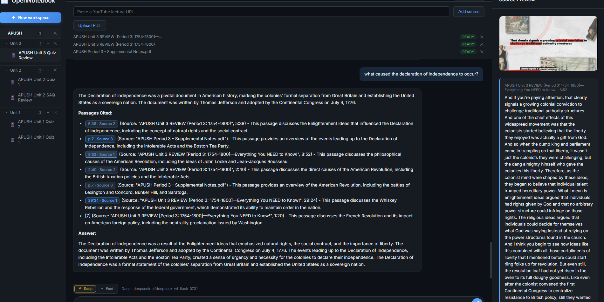

# Anchor

<p align="center">
  
</p>

<p align="center"><strong>Study deeply. Cram intelligently.</strong></p>

Anchor is an open-source, self-hostable study environment. Everything is
organized as **Course → Unit → Sources → Study Session**: create a course, add
a unit, drop in lectures and PDFs, and study inside a workspace where every
answer links back to the material it came from.

Drop in a lecture or PDF, ask questions, and get answers grounded in your
material with clickable citations back to the exact timestamp or page. On top
of that foundation: per-objective study guides, server-graded multiple-choice
practice quizzes, and a weak-spots panel that shows where you're losing points.

Bring your own model — cloud (NVIDIA NIM, OpenRouter, OpenAI) or local
(Ollama, LM Studio) — through one OpenAI-compatible config. Zero-config
defaults handle embeddings, reranking, and transcription locally.

## Screenshot



## Quick start

```bash
git clone https://github.com/sarthakbagal23/Anchor.git
cd Anchor
python -m venv .venv
.venv/Scripts/activate          # Windows; `source .venv/bin/activate` on macOS/Linux
pip install -e ".[local]"       # fastapi + faster-whisper + sentence-transformers + yt-dlp
python main.py                  # opens http://127.0.0.1:8765 in your browser
```

Windows shortcut: double-click `run-server.cmd` instead — it refuses a second
instance, restarts the server if it exits, and logs restarts to
`server-out.log`.

On first run, edit `~/.opennotebook/config.yaml`: set an LLM `base_url`,
`api_key`, and `model`. Everything else works with bundled defaults (see
[`config.example.yaml`](config.example.yaml)). API keys are redacted in API
responses and are never sent to the browser.

## Features

- **Sources** — YouTube lectures (downloaded, transcribed with timestamps) and
  PDFs (extracted per page), with ingest progress in the UI and duplicate-URL
  detection so the same lecture is never indexed twice.
- **Grounded chat** — every answer cites its evidence as `[#]`; click a
  citation to seek the video or jump to the PDF page (with highlight). PDF
  questions use a vision model when one is configured, with automatic fallback
  to the text stream, timeouts, and one in-flight question at a time.
- **Study guides** — one persisted, regenerable section per learning
  objective, each grounded in your sources.
- **Practice quizzes** — server-graded multiple choice where the answer key
  never reaches the client; attempts are recorded per question.
- **Weak spots** — per-objective accuracy from your attempts, worst first, so
  you know what to review next.
- **Objectives two ways** — a built-in topic framework for 38 AP courses
  (including casual titles like `apush` or `ap csa`), or automatic AI
  extraction for everything else once a source finishes indexing.

## How it works

1. **Ingest**: `yt-dlp` pulls audio → `faster-whisper` transcribes with
   timestamps → a timestamp-preserving chunker groups segments (PDFs are
   extracted per page) → chunks are embedded in one batched call and stored in
   SQLite + sqlite-vec with a single commit.
2. **Ground**: each question is embedded → sqlite-vec retrieves candidates
   from *ready* sources in your workspace → a cross-encoder reranks → the top
   passages are fit to the model's context window (so local 8k models still
   work) alongside a budgeted slice of recent history → a strict
   answer-from-passages prompt is streamed back with a citation map.
3. **Cite**: `[#]` markers map to `(source, timestamp/page)`; the frontend
   renders them as clickable tokens.

## Development

```bash
python -m pytest tests/ -q   # hermetic contract tests (tmp DBs, stub LLM, no network)
ruff check backend tests main.py
python backend/store.py       # per-module __main__ self-checks work the same way
```

CI runs pytest + ruff on every push and PR. Each backend module also carries
assert-based `__main__` self-checks for fast single-file verification; `tests/`
holds the cross-module contracts. Layout: `backend/` (api, store, config,
`grounding/`, `ingestion/`, `objectives/`, `practice/`, `study/`), `frontend/`
(plain HTML/CSS/JS, no build step), `main.py` (server + static mount).

## Current limitations

- **Local, single-user.** No login and no multi-user isolation — anyone who
  can reach the port can use the app. Browser-attack surface is guarded
  (CSRF/Host checks), but don't expose it to a network you don't trust.
- **Model latency varies.** Hosted models can stall on the first token; the UI
  bounds every wait with timeouts and falls back gracefully, but a slow
  provider still means slow answers.
- **Vision default is NVIDIA-specific.** PDF visual questions default to
  `meta/llama-3.2-11b-vision-instruct`; point `vision_model` at your own
  provider if you use Ollama/LM Studio/OpenRouter.
- **Experimental extras live elsewhere.** Multi-user cloud auth sits on the
  unmerged `cloud-auth` branch and is not part of this release.

## License

MIT — see [`LICENSE`](LICENSE). Issues and PRs welcome; this is early software,
so expect rough edges and report them.
